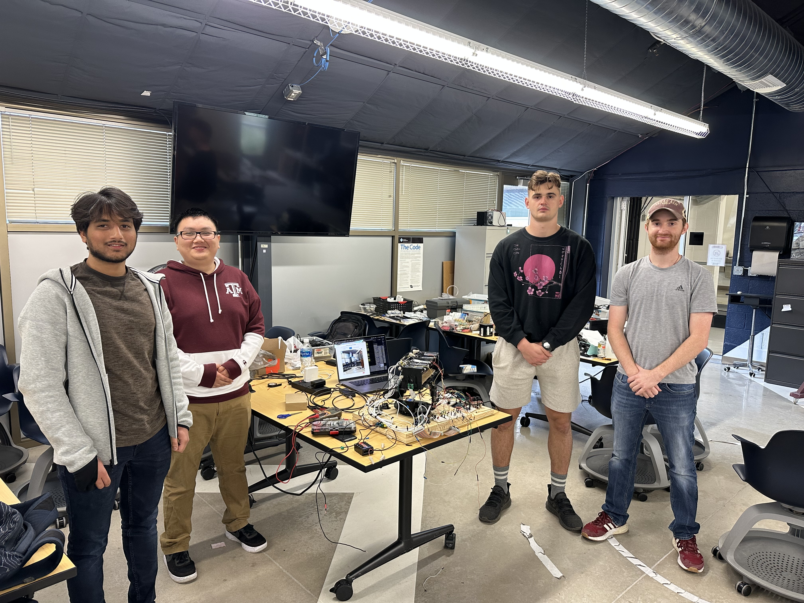
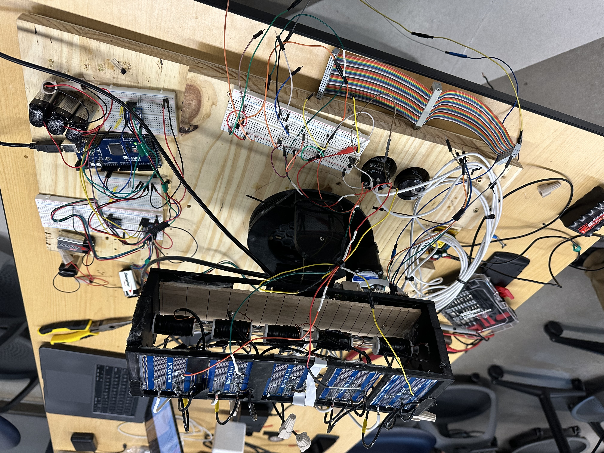
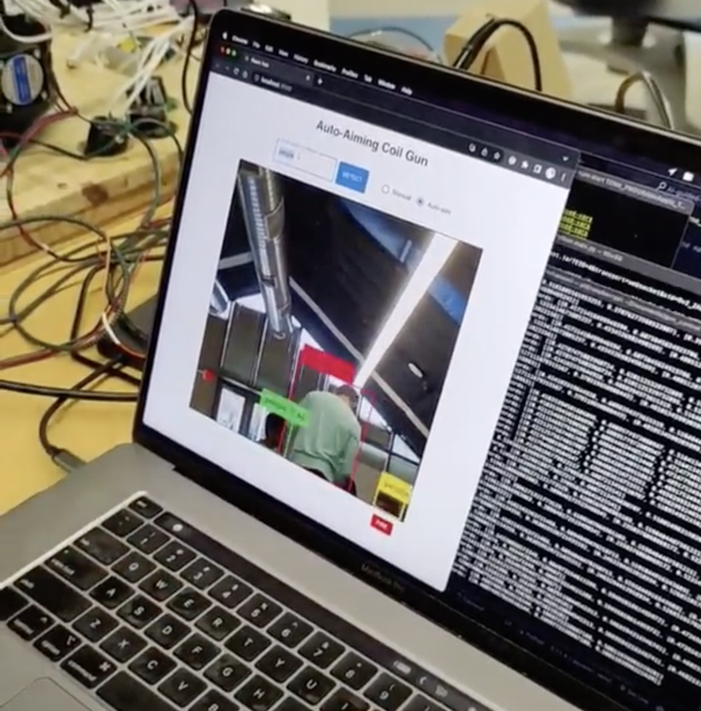

# AI-Guided Coil Gun

Capstone project.

### Group Members
**Eashan Soni (team lead)**, Carson Aulbaugh, Gregory Manternach, Michael Pham

We successfully designed an AI-controlled, auto-aiming coil gun. It uses AI 
to detect any arbitrary object, and algorithms to autonomously aim the gun 
and fire at targets. The user can also choose to control the gun manually. 
Everthing is controlled remotely. The coil gun fires the projectiles using 
electromagnetic force. The projectiles travel at around 15 m/s.

<table>
  <tr>
    <td colspan="3" align="center"></td>
  </tr>
  <tr>
    <td></td>
    <td></td>
  </tr>
</table>

## Technical Overview
This project was an amazing experience in software design, AI, hardware 
design, and the optimal integration between them.

The main sub-systems of the project are:
- Object detection
- Coil gun
- Motor control
- Web-based UI
  - React frontend
  - Flask backend

The project utilizes the following components:
- Raspberry Pi 4 (main controller)
- Portable battery (powering the Pi)
- Camera module (imagery)
- AWS GPU instance (object detection)
- Arduino (motor control interface)
- 2x Stepper motors (gun movement)
- 2x Stepper motor controllers (controlling the stepper motors)
- 6x 9V batteries (powering each stepper motor with 3 batteries)
- 12VDC power supply (coil gun power)
- 5x 450V 680uF high-power capacitors (coil gun firing)
- 12VDC to 450VDC boost converter (charging high-power capacitors)
- 5x coils (coil gun firing)
- 5x Thyristors (coil gun triggering)
- 5x BJTs (coil gun triggering through GPIO of Pi)
- Various safety diodes, resistors, wiring, perfboards, breadboards, etc.

### Camera Streaming
The Raspberry Pi 4 is the main controller of the entire system. Real-time 
imagery is captured by the camera, and the Pi streams this imagery to the 
UI. The UI is a web-based interface that consists of a React-based frontend, 
and a Flask-based backend. Through websockets a real-time connection is 
established between the frontend, backend, and Pi. This enables the real-time 
imagery to be displayed on the UI.

### Object Detection
For object detection, the backend also simultaneuously streams the imagery 
to the GPU server using websockets. This GPU server is a deep learning 
instance commissioned on AWS that hosts a multi-modal computer vision model 
called [Grounding DINO](https://github.com/IDEA-Research/GroundingDINO). 
This is a cutting-edge computer vision model that accepts text prompts to 
detect any object in an image. For example, I can prompt 'windows', and it 
will detect all the windows in the image. Or I could prompt 'human faces', 
and it will detect all the human faces in the image.

This allows our coil gun to detect and shoot any arbitrary object in its 
field of view. The text prompts are provided by the user on the UI, and the 
GPU server streams the detections back to the UI. The UI subsequently 
displays the detections to the user, and sends the detections to the Pi to 
auto-aim (if in auto-aim mode).

### Gun Movement
The user can also control the movement of the gun manually using the WASD 
keys. Movement commands are streamed in real-time from the UI to the Pi 
using websockets. When a movement command is received, the Pi sends a command 
to the Arduino to move the stepper motors in the appropriate direction. The 
Arduino then sends the appropriate DIR (direction) and STEP (microstep) 
signals to the stepper motor drivers to move the stepper motors, until it 
receives a stop signal from the Pi.

Why doesn't the Pi just communicate with the drivers directly? This is 
because the Pi already needs to handle the real-time camera streaming, which 
consumes many cycles. Also, the step motor drivers constantly need a STEP 
signal to move the motors. If we had both the stepper motor control and the 
camera streaming on the same device, this would overload the device, and 
either the frame-rate of the camera, or the latency of the motor movements 
would have to be sacrificed. So, by offloading the motor movement to another 
device, we can concurrently have both high frame-rate imagery, and 
low-latency movement.

The gun can also auto-aim. The UI's backend sends the coordinates of the 
targets to auto-aim at, ranked from highest to lowest confidence. When the Pi 
receives the coordinates, it uses an algorithm to translate each 2D 
coordinate into how much to move the left/right motor and up/down motor. 
This required lots of fine-tuning as well. In the end, the auto-aiming is 
approx. 90% accurate.

### Coil Gun
A coil gun fires projectiles by taking advantage of the Lorentz force. When 
an electric current is induced through a coil, the coil becomes magnetic, 
pulling the projectile to the center of the coil. If the power to the coil 
is cut just as the projectile reaches the center of the coil, the projectile 
will launch outward. The speed at which the projectile launches is determined 
by how much voltage is sent through the coil. The higher the voltage, the 
higher velocity that the projectile will be drawn to the center of the coil. 
This is why we use high-voltage capacitors along with a boost converter to 
dump a huge amount of voltage quickly into the coil.

The energizing of the coil is triggered by the thyristor. A thyristor is a 
semiconductor device that is specialized for switching very high-power loads. 
The thyristor is switched by a BJT, to interface with the Pi's GPIOs. 
Additionally, multiple stages are used to boost the projectile's acceleration 
even further. Lots of fine-tuning was done to switch the GPIOs to energize 
and de-energize the coils at just the right time to maximize the velocity 
of the projectile. In the end, our projectiles travel at around 15 m/s, 
enough to puncture a 2 cm block of wood.